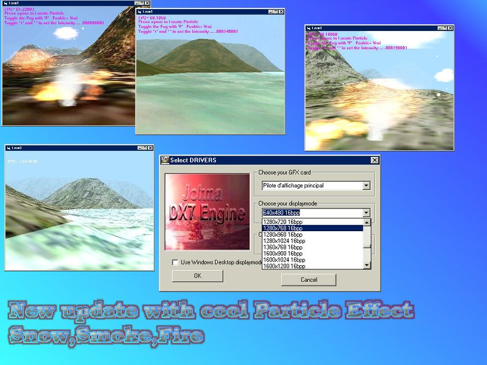

## JohnaDX7 3D engine UPDATE with great Particle Effect

### Description

Hi

go to http://www.planetsourcecode.com/vb/scripts/ShowCode.asp?txtCodeId=33002&lngWId=1

i have added new Smoke,Snow,Fire particle effect over the huge landscape

do not download by clicking on the link below

you have to go to my previous submission at this

http://www.planetsourcecode.com/vb/scripts/ShowCode.asp?txtCodeId=33002&lngWId=1

Don't forget to support me by your votes
 
### More Info
 

             |
---                |---
**Submitted On**   |2002-03-23 23:47:26
**By**             |[polaris](https://github.com/Planet-Source-Code/PSCIndex/blob/master/ByAuthor/polaris.md)
**Level**          |Advanced
**User Rating**    |5.0 (20 globes from 4 users)
**Compatibility**  |VB 4\.0 \(32\-bit\), VB 5\.0, VB 6\.0
**Category**       |[DirectX](https://github.com/Planet-Source-Code/PSCIndex/blob/master/ByCategory/directx__1-44.md)
**World**          |[Visual Basic](https://github.com/Planet-Source-Code/PSCIndex/blob/master/ByWorld/visual-basic.md)
**Archive File**   |[JohnaDX7\_3651033242002\.zip](https://github.com/Planet-Source-Code/polaris-johnadx7-3d-engine-update-with-great-particle-effect__1-33032/archive/master.zip)

